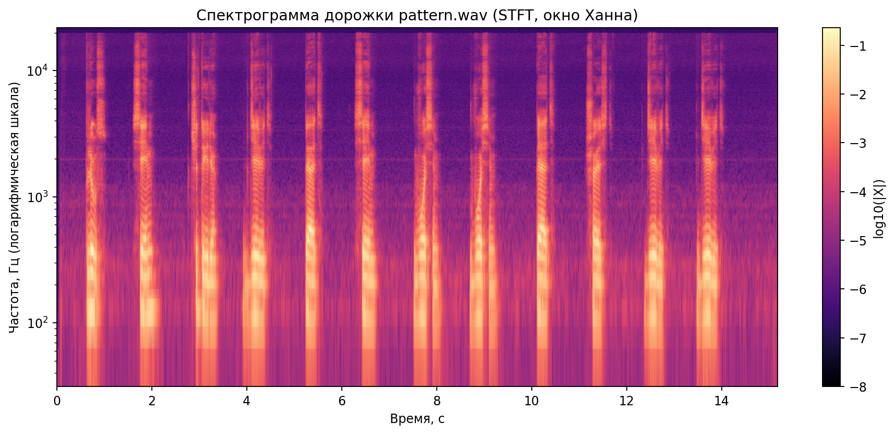
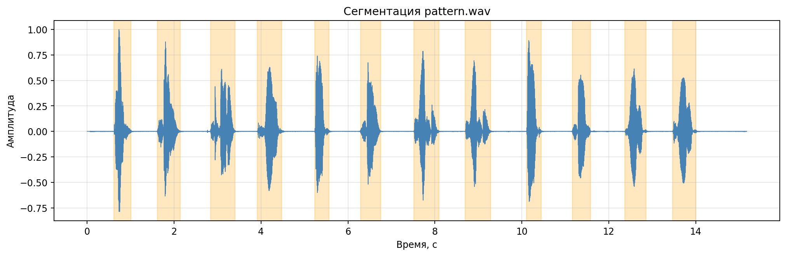

# Лабораторная работа №10. Обработка голоса

## Вариант 3. Анализатор речи

## 1. Подготовка алфавита и записи номера

- Алфавит загружен из `src`: `+.wav`, `0.wav`, `1.wav`, ..., `9.wav` (11 образцов).
- Анализируемая дорожка: `src/pattern.wav`.
- Частота дискретизации: **44100 Гц**
- Длительность `pattern.wav`: **15.174 с**
- Количество каналов: 1

## 2. Спектрограмма записи номера (STFT, окно Ханна)

Построена и сохранена спектрограмма дорожки `pattern.wav` с логарифмической шкалой частот.

## 3. Сегментация звуковой дорожки

Реализована автоматическая сегментация по кратковременной энергии с морфологическим сглаживанием и объединением коротких пауз.

- Количество найденных сегментов: **12**
- Визуализация сегментации: `results/segmentation.png`
- Вырезанные сегменты: `results/segments/segment_XX.wav`

## 4. Процедура сопоставления сегмента и образца

Для каждого сегмента:
1. Нормализация, обрезка тишины и ресемплинг до 16 кГц.
2. Извлечение признаков из STFT (лог-амплитудный спектр в диапазоне 80..4000 Гц).
3. Сопоставление с 11 эталонами алфавита с помощью DTW по косинусной мере.
4. Выбор символа с минимальной дистанцией и оценка confidence.

Подробности сопоставления сохранены в `results/segment_matches.csv`.

## 5. Распознавание телефонного номера, ошибки и достоверность

- Распознанная цепочка символов: **+74957885679**
- Интегральная достоверность (среднее confidence): **0.255**
- Эталон: **+74957885699**
- Число ошибок (расстояние Левенштейна): **1**
- Точность распознавания: **91.67%**

### Распознавание по сегментам
- Сегмент 00: `[0.62; 1.01] c` -> **+**, confidence=0.233
- Сегмент 01: `[1.62; 2.14] c` -> **7**, confidence=0.317
- Сегмент 02: `[2.84; 3.41] c` -> **4**, confidence=0.480
- Сегмент 03: `[3.91; 4.48] c` -> **9**, confidence=0.050
- Сегмент 04: `[5.24; 5.56] c` -> **5**, confidence=0.273
- Сегмент 05: `[6.29; 6.75] c` -> **7**, confidence=0.260
- Сегмент 06: `[7.51; 8.09] c` -> **8**, confidence=0.408
- Сегмент 07: `[8.69; 9.29] c` -> **8**, confidence=0.457
- Сегмент 08: `[10.11; 10.44] c` -> **5**, confidence=0.300
- Сегмент 09: `[11.16; 11.58] c` -> **6**, confidence=0.078
- Сегмент 10: `[12.37; 12.86] c` -> **7**, confidence=0.080
- Сегмент 11: `[13.47; 14.00] c` -> **9**, confidence=0.126

### Неоднозначные позиции распознавания
- Сегмент 03: выбран **9** при низкой уверенности `confidence=0.050`; альтернативы: 9 (0.235), 5 (0.248), 7 (0.260)
- Сегмент 09: выбран **6** при низкой уверенности `confidence=0.078`; альтернативы: 6 (0.263), 5 (0.286), 2 (0.303)
- Сегмент 10: выбран **7** при низкой уверенности `confidence=0.080`; альтернативы: 7 (0.244), 9 (0.265), 5 (0.310)

## Заключение

- Использован алфавит из 11 заранее записанных образцов;
- Построена спектрограмма `pattern.wav` (STFT, окно Ханна, логарифмическая частотная шкала);
- Реализованы процедуры сегментации и сопоставления сегмент/образец;
- Выполнено распознавание номера и рассчитана оценка достоверности.
