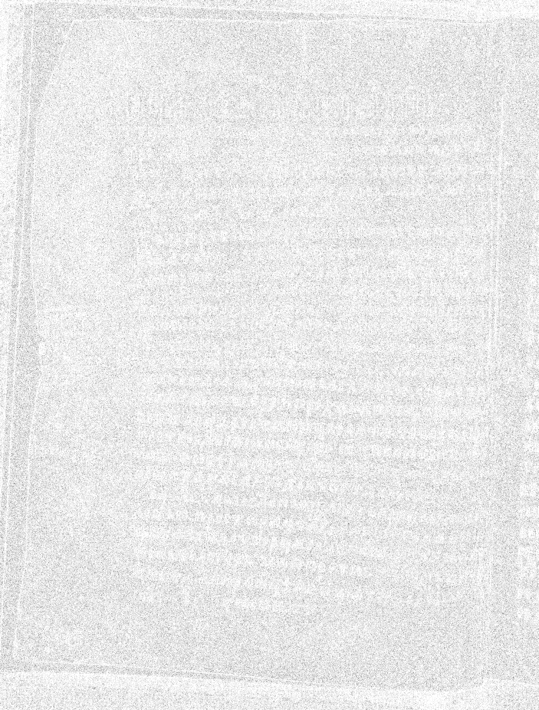
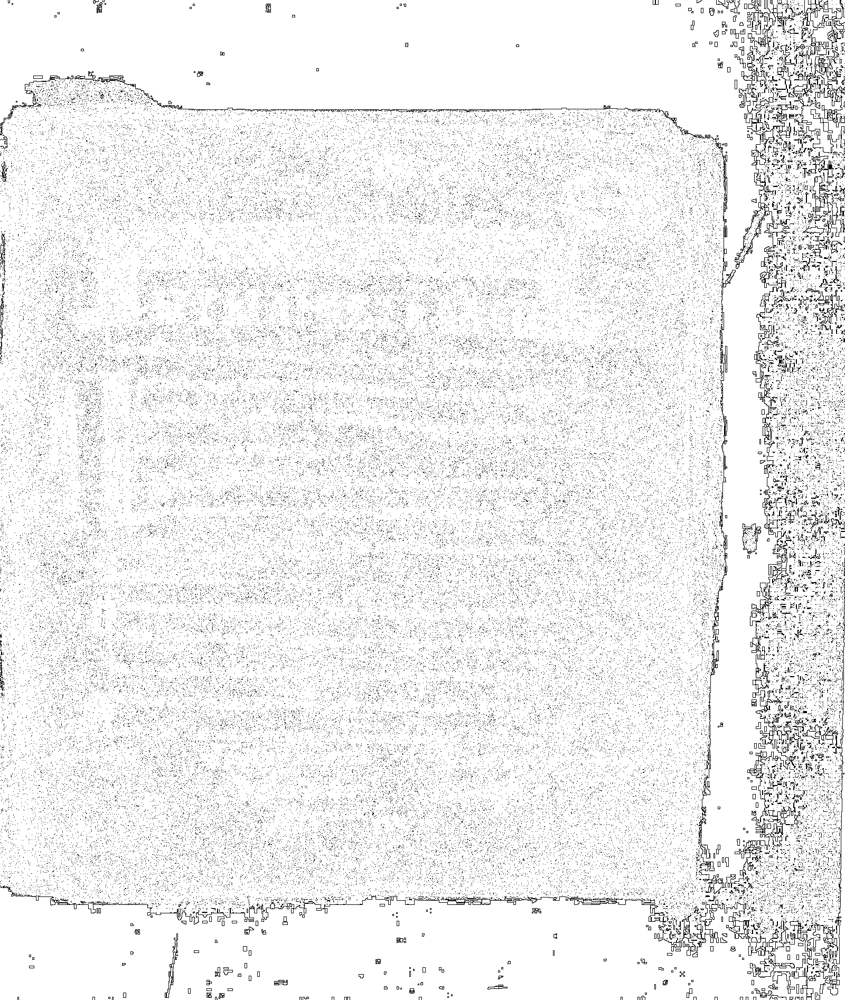
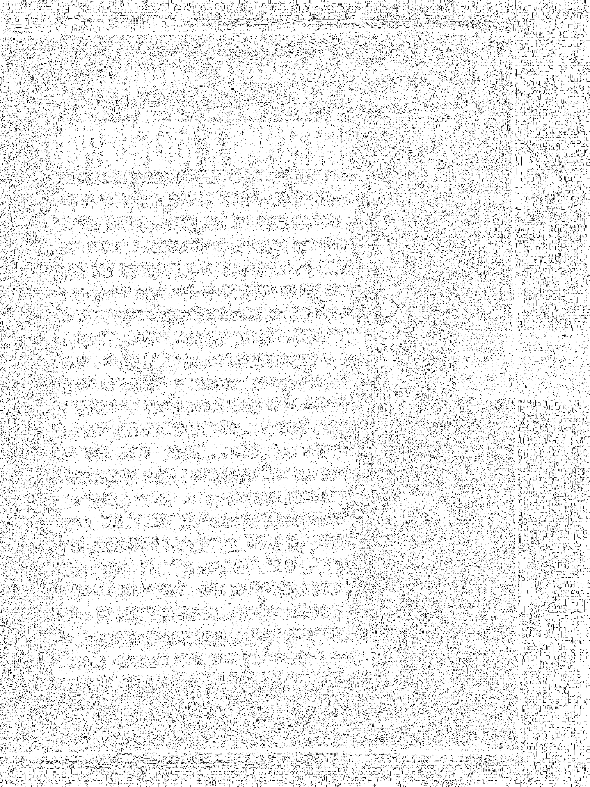
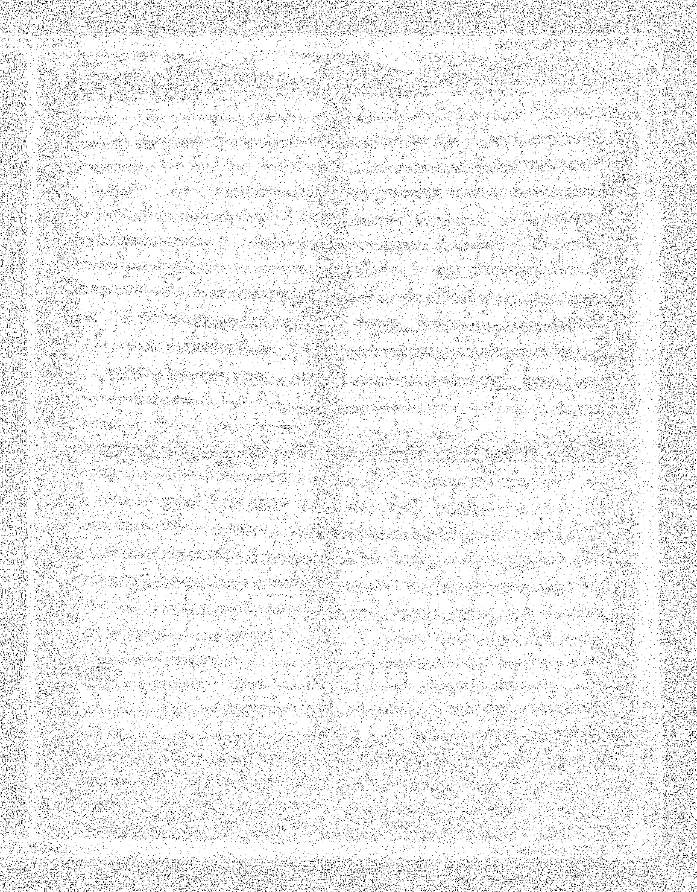

# Лабораторная работа №2

## Вариант 9: Адаптивная бинаризация Сингха (окно 3×3)

#### Для преобразования полноцветного изображения в полутоновое использовалось взвешенное усреднение каналов RGB:

$$Y = 0.299 \cdot R + 0.587 \cdot G + 0.114 \cdot B$$

#### Адаптивная бинаризация методом Сингха

Порог вычисляется по формуле:

$$T_{Singh} = m \left( 1 + k \left( \frac{\delta}{1-\delta} - 1 \right) \right)$$

Для ускорения вычислений использованы **интегральные изображения**.

### 3. Результаты работы

#### Изображение 1:

| Исходное | Полутоновое | Бинаризованное (Сингх 3×3) |
|:--------:|:-----------:|:--------------------------:|
|  |  |  |

#### Изображение 2:

| Исходное | Полутоновое | Бинаризованное (Сингх 3×3) |
|:--------:|:-----------:|:--------------------------:|
|  |  |  |

#### Изображение 3:

| Исходное | Полутоновое | Бинаризованное (Сингх 3×3) |
|:--------:|:-----------:|:--------------------------:|
|  |  |  |

#### Изображение 4:

| Исходное | Полутоновое | Бинаризованное (Сингх 3×3) |
|:--------:|:-----------:|:--------------------------:|
|  |  |  |

#### Изображение 5:

| Исходное | Полутоновое | Бинаризованное (Сингх 3×3) |
|:--------:|:-----------:|:--------------------------:|
|  |  |  |

### 4. Влияние параметра k на результат бинаризации

| k = 0.3 | k = 0.5 | k = 0.7 | k = 0.9 |
|:-------:|:-------:|:-------:|:-------:|
|  |  |  |  |

### Заключение

В ходе выполнения лабораторной работы были реализованы:

1. **Преобразование RGB → полутон** с использованием взвешенного усреднения

2. **Адаптивная бинаризация методом Сингха** с окном 3×3:
   - Реализована формула порога $T = m(1 + k(\delta/(1-\delta) - 1))$
   - Применены интегральные изображения для оптимизации вычислений
   - Исследовано влияние параметра k на результат

3. **Обработка типов изображений**:
   - Текстовые страницы