# Лабораторная работа №5. Выделение признаков символов

## Вариант 9: Сингальский алфавит

#### Генерация эталонных изображений символов

**Параметры генерации:**
- Цвет символа: чёрный (0, 0, 0, 255)
- Фон: прозрачный (255, 255, 255, 0)

---

### 1. Эталонные изображения символов (полный список)

| № | Символ | Название | Unicode | Размер (px) | Изображение |
|:-:|:------:|:---------|:-------:|:-----------:|:-----------:|
| 1 | අ | Ayanna | U+0D85 | 95×139 | 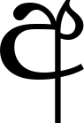 |
| 2 | ආ | Aayanna | U+0D86 | 156×139 | 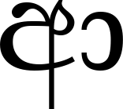 |
| 3 | ඇ | Aeyanna | U+0D87 | 155×139 | 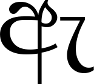 |
| 4 | ඈ | Aeeyanna | U+0D88 | 155×139 | 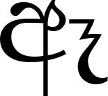 |
| 5 | ඉ | Iyanna | U+0D89 | 100×119 |  |
| 6 | ඊ | Iiyanna | U+0D8A | 95×135 | 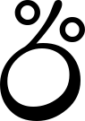 |
| 7 | උ | Uyanna | U+0D8B | 120×119 |  |
| 8 | ඌ | Uuyanna | U+0D8C | 183×113 | 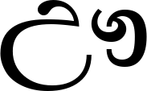 |
| 9 | ඍ | Iruyanna | U+0D8D | 172×87 |  |
| 10 | ඎ | Iruuyanna | U+0D8E | 176×66 |  |
| 11 | ඏ | Iluyanna | U+0D8F | 127×87 |  |
| 12 | ඐ | Iluuyanna | U+0D90 | 177×74 |  |
| 13 | එ | Eyanna | U+0D91 | 103×119 |  |
| 14 | ඒ | Eeyanna | U+0D92 | 118×135 |  |
| 15 | ඓ | Aiyanna | U+0D93 | 177×96 |  |
| 16 | ඔ | Oyanna | U+0D94 | 111×119 |  |
| 17 | ඕ | Ooyanna | U+0D95 | 111×119 |  |
| 18 | ඖ | Auyanna | U+0D96 | 182×113 | 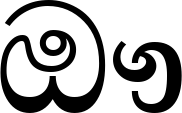 |
| 19 | ක | Alpapraana Kayanna | U+0D9A | 142×87 |  |
| 20 | ඛ | Mahaapraana Kayanna | U+0D9B | 111×125 |  |
| 21 | ග | Alpapraana Gayanna | U+0D9C | 110×87 |  |
| 22 | ඝ | Mahaapraana Gayanna | U+0D9D | 113×87 | 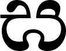 |
| 23 | ඞ | Kantaja Naasikyaya | U+0D9E | 115×119 | 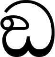 |
| 24 | ඟ | Sanyaka Gayanna | U+0D9F | 124×87 |  |
| 25 | ච | Alpapraana Cayanna | U+0DA0 | 103×119 |  |
| 26 | ඡ | Mahaapraana Cayanna | U+0DA1 | 105×119 | 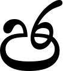 |
| 27 | ජ | Alpapraana Jayanna | U+0DA2 | 106×120 |  |
| 28 | ඣ | Mahaapraana Jayanna | U+0DA3 | 176×101 | 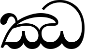 |
| 29 | ඤ | Taaluja Naasikyaya | U+0DA4 | 179×136 |  |
| 30 | ට | Alpapraana Ttayanna | U+0DA7 | 104×119 |  |
| 31 | ඨ | Mahaapraana Ttayanna | U+0DA8 | 111×119 |  |
| 32 | ඩ | Alpapraana Ddayanna | U+0DA9 | 114×119 | 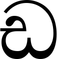 |
| 33 | ඪ | Mahaapraana Ddayanna | U+0DAA | 114×119 | 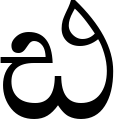 |
| 34 | ණ | Muurdhaja Nayanna | U+0DAB | 172×102 |  |
| 35 | ඬ | Sanyaka Ddayanna | U+0DAC | 111×119 |  |
| 36 | ත | Alpapraana Tayanna | U+0DAD | 120×87 |  |
| 37 | ථ | Mahaapraana Tayanna | U+0DAE | 111×119 |  |
| 38 | ද | Alpapraana Dayanna | U+0DAF | 70×136 | 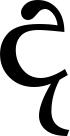 |
| 39 | ධ | Mahaapraana Dayanna | U+0DB0 | 111×119 |  |
| 40 | න | Dantaja Nayanna | U+0DB1 | 147×87 | 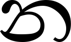 |
| 41 | ඳ | Sanyaka Dayanna | U+0DB3 | 90×136 |  |
| 42 | ප | Alpapraana Payanna | U+0DB4 | 100×87 |  |
| 43 | ඵ | Mahaapraana Payanna | U+0DB5 | 100×119 |  |
| 44 | බ | Alpapraana Bayanna | U+0DB6 | 111×119 |  |
| 45 | භ | Mahaapraana Bayanna | U+0DB7 | 115×87 |  |
| 46 | ම | Mayanna | U+0DB8 | 111×119 |  |
| 47 | ඹ | Amba Bayanna | U+0DB9 | 110×119 | 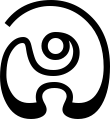 |
| 48 | ය | Yayanna | U+0DBA | 110×87 |  |
| 49 | ර | Rayanna | U+0DBB | 97×123 | 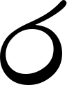 |
| 50 | ල | Dantaja Layanna | U+0DBD | 121×119 |  |
| 51 | ව | Vayanna | U+0DC0 | 100×119 |  |
| 52 | ළ | Muurdhaja Layanna | U+0DC5 | 121×119 |  |
| 53 | ශ | Taaluja Sayanna | U+0DC1 | 110×87 |  |
| 54 | ෂ | Muurdhaja Sayanna | U+0DC2 | 100×87 |  |
| 55 | ස | Dantaja Sayanna | U+0DC3 | 113×87 |  |
| 56 | හ | Hayanna | U+0DC4 | 114×87 |  |
| 57 | ෆ | Fayanna | U+0DC6 | 110×78 |  |
| 58 | ් | Ал-лакуна | U+0DCA | 33×66 |  |
| 59 | ා | Аела-пилла | U+0DCF | 54×75 |  |
| 60 | ැ | Кетти аеда-пилла | U+0DD0 | 57×93 |  |
| 61 | ෑ | Дига аеда-пилла | U+0DD1 | 57×94 |  |
| 62 | ි | Кетти ис-пилла | U+0DD2 | 97×51 |  |
| 63 | ී | Дига ис-пилла | U+0DD3 | 98×53 |  |
| 64 | ු | Кетти паа-пилла | U+0DD4 | 109×75 |  |
| 65 | ූ | Дига паа-пилла | U+0DD6 | 109×77 |  |
| 66 | ෘ | Гаетта-пилла | U+0DD8 | 54×75 |  |
| 67 | ෙ | Комбува | U+0DD9 | 109×87 |  |
| 68 | ේ | Дига комбува | U+0DDA | 163×135 | 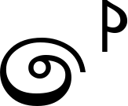 |
| 69 | ෛ | Комбу дека | U+0DDB | 185×70 |  |
| 70 | ො | Комбува хаа аела-пилла | U+0DDC | 169×87 |  |
| 71 | ෝ | Комбува хаа дига аела-пилла | U+0DDD | 183×122 | 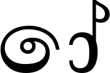 |
| 72 | ෞ | Комбува хаа гаянутитта | U+0DDE | 176×79 | 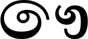 |
| 73 | ෟ | Гаянуктитта | U+0DDF | 74×76 | 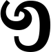 |
| 74 | ෲ | Дига гаетта-пилла | U+0DF2 | 116×75 |  |
| 75 | ෳ | Дига гаяануктитта | U+0DF3 | 74×76 | 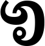 |
| 76 | ෴ | Кунддалия | U+0DF4 | 172×66 |  |

---

### 2. Рассчитанные признаки

Для каждого символа рассчитываются следующие признаки:

#### 2.1. Вес чёрного каждой четверти

Изображение символа делится на 4 равные четверти, для каждой вычисляется сумма чёрных пикселей.

#### 2.2. Удельный вес четвертей

Вес каждой четверти нормируется на площадь четверти:

$$\text{weight}_{rel} = \frac{\text{weight}_{quarter}}{\text{area}_{quarter}}$$

#### 2.3. Координаты центра тяжести

Абсолютные координаты центра тяжести символа:

$$\bar{x} = \frac{1}{W}\sum_{x=0}^{W-1}\sum_{y=0}^{H-1} x \cdot f(x,y) \quad \bar{y} = \frac{1}{W}\sum_{x=0}^{W-1}\sum_{y=0}^{H-1} y \cdot f(x,y)$$

где $f(x,y)$ — бинарная функция яркости (1 — чёрный, 0 — белый).

#### 2.4. Нормированные координаты центра тяжести

$$cx_{rel} = \frac{cx}{W} \quad cy_{rel} = \frac{cy}{H}$$

#### 2.5. Осевые моменты инерции

$$I_x = \sum_{x=0}^{W-1}\sum_{y=0}^{H-1} (y - \bar{y})^2 \cdot f(x,y)$$

$$I_y = \sum_{x=0}^{W-1}\sum_{y=0}^{H-1} (x - \bar{x})^2 \cdot f(x,y)$$

#### 2.6. Нормированные осевые моменты инерции

$$I_x^{norm} = \frac{I_x}{W \cdot H} \quad I_y^{norm} = \frac{I_y}{W \cdot H}$$

#### 2.7. Профили X и Y

Вертикальный профиль (проекция на X):

$$Proj_X[y] = \sum_{x=0}^{W-1} f(x, y)$$

Горизонтальный профиль (проекция на Y):

$$Proj_Y[x] = \sum_{y=0}^{H-1} f(x, y)$$

---

### 3. Пример рассчитанных признаков

#### Символ: අ (U+0D85)

| Признак | Значение |
|:--------|---------:|
| Размер изображения | 95 × 139 px |
| **Вес четвертей:** | |
| Q1 (верхний левый) | 1235 |
| Q2 (верхний правый) | 1225 |
| Q3 (нижний левый) | 527 |
| Q4 (нижний правый) | 829 |
| **Удельный вес четвертей:** | |
| Q1_rel | 0.3808 |
| Q2_rel | 0.3777 |
| Q3_rel | 0.1625 |
| Q4_rel | 0.2556 |
| **Центр тяжести:** | |
| cx | 46.94 |
| cy | 51.80 |
| **Нормированный центр тяжести:** | |
| cx_rel | 0.4941 |
| cy_rel | 0.3727 |
| **Осевые моменты инерции:** | |
| Ix | 4,045,981.6 |
| Iy | 2,689,725.5 |
| **Нормированные моменты:** | |
| Ix_norm | 306.40 |
| Iy_norm | 203.69 |

---

### 4. Профили символов

Профили представлены в виде столбчатых диаграмм с целыми числами на осях.

#### Символ: අ (U+0D85)

| Вертикальный профиль (проекция на X) | Горизонтальный профиль (проекция на Y) |
|:-----------------------------------:|:-------------------------------------:|
| 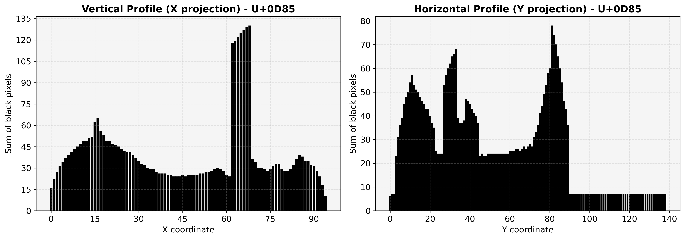 |  |

#### Символ: ක (U+0D9A)

| Вертикальный профиль (проекция на X) | Горизонтальный профиль (проекция на Y) |
|:-----------------------------------:|:-------------------------------------:|
| 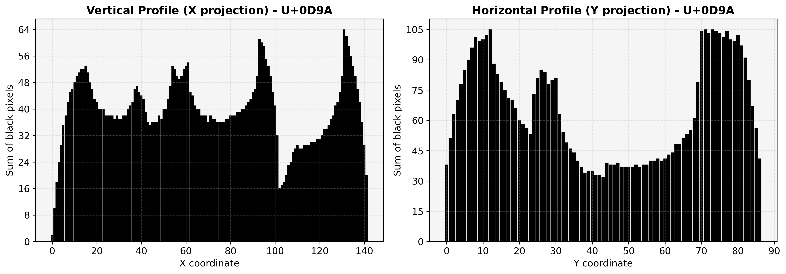 |  |

#### Символ: ම (U+0DB8)

| Вертикальный профиль (проекция на X) | Горизонтальный профиль (проекция на Y) |
|:-----------------------------------:|:-------------------------------------:|
| 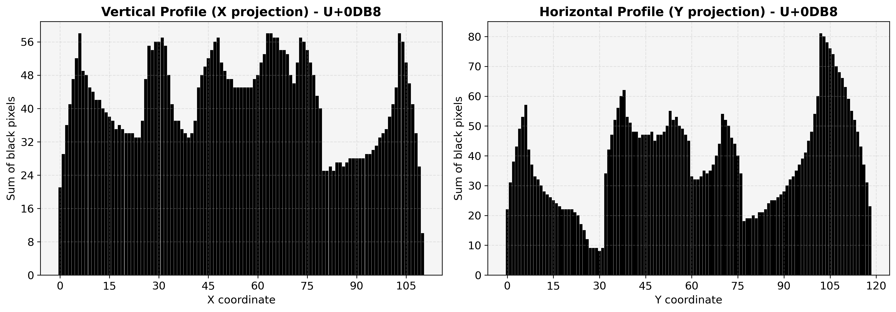 |  |

---

### Заключение

В ходе лабораторной работы №5 выполнены следующие задачи:

1. **Генерация эталонных изображений** 76 символов сингальского алфавита с прозрачным фоном
2. **Расчёт скалярных признаков** для каждого символа:
   - Вес чёрного каждой четверти
   - Удельный вес четвертей
   - Координаты центра тяжести (абсолютные и нормированные)
   - Осевые моменты инерции (абсолютные и нормированные)
3. **Сохранение признаков** в CSV-файл (разделитель «точка с запятой»)
4. **Построение профилей X и Y** в виде столбчатых диаграмм с целыми числами на осях

**Результаты сохранены в папке:** `sinhala_chars/`
- Изображения символов: `*.png`
- Скалярные признаки: `features.csv`
- Профили: `profiles/*.png`