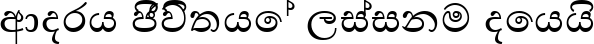
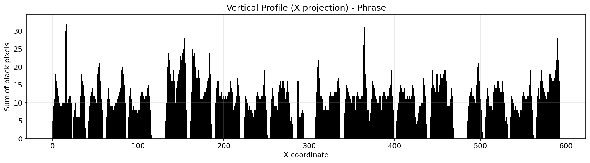
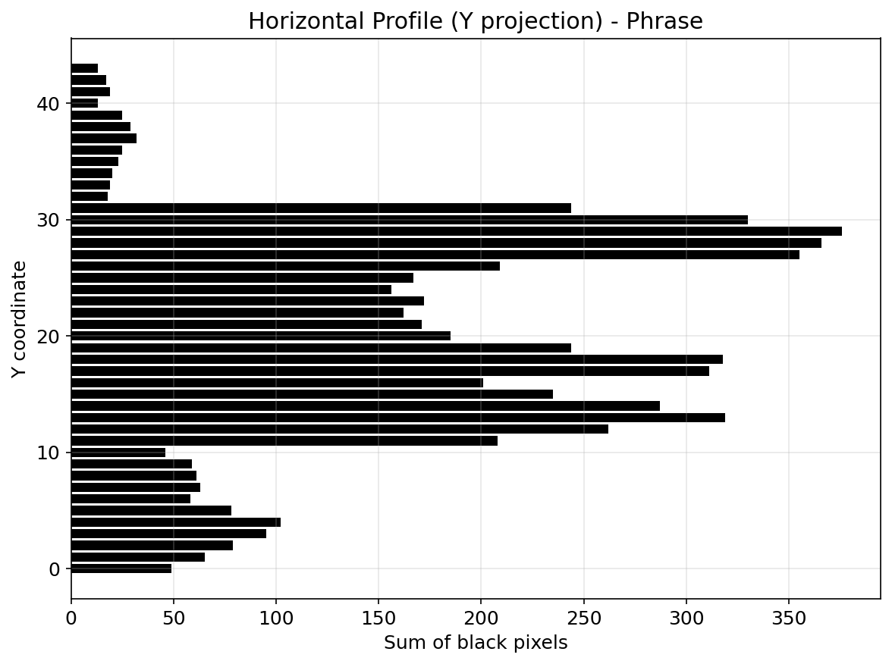
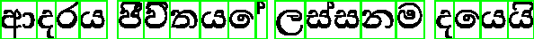
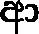

# Лабораторная работа №6. Сегментация текста

## Вариант 9: Сингальский алфавит

### Романтическая фраза

**Фраза на сингальском языке:**  
`ආදරය ජීවිතයේ ලස්සනම දෙයයි`

**Перевод:** *"Любовь - самое прекрасное в жизни"*

---

### 1. Изображение фразы (монохромный BMP, без белого фона)

---

### 2. Профили изображения

#### 2.1. Вертикальный профиль (проекция на ось X)

#### 2.2. Горизонтальный профиль (проекция на ось Y)

---

### 3. Сегментация символов

#### 3.1. Алгоритм сегментации

1. Вычисление вертикального профиля изображения
2. Прореживание профиля: объединение близких ненулевых областей
3. Поиск переходов "пусто-заполнено" (начало символа) и "заполнено-пусто" (конец символа)
4. Вырезание символов по найденным границам

#### 3.2. Результат сегментации с ограничивающими прямоугольниками

Зелёными рамками отмечены границы каждого найденного символа.

#### 3.3. Найденные символы

| № | Координаты X | Размер (px) |                          Изображение                          |
|:-:|:------------:|:-----------:|:-------------------------------------------------------------:|
| 1 | [0-24] | 22×34 |   |
| 2 | [23-39] | 12×18 |   |
| 3 | [40-60] | 16×33 |   |
| 4 | [61-87] | 23×30 |   |
| 5 | [87-117] | 26×21 |   |
| 6 | [130-159] | 25×32 |   |
| 7 | [159-187] | 24×32 |   |
| 8 | [188-220] | 29×21 |   |
| 9 | [222-252] | 26×21 |   |
| 10 | [253-282] | 26×21 |  |
| 11 | [284-295] | 8×16 |  |
| 12 | [305-337] | 28×29 |  |
| 13 | [338-400] | 58×32 |  |
| 14 | [400-438] | 35×21 |  |
| 15 | [440-470] | 26×29 |  |
| 16 | [483-503] | 16×33 |  |
| 17 | [504-533] | 26×21 |  |
| 18 | [533-563] | 26×21 |  |

**Всего найдено символов:** 18

---

### Заключение

В ходе выполнения лабораторной работы №6 были решены следующие задачи:

1. **Создание изображения фразы**  
   - Выбрана романтическая фраза на сингальском языке: "ආදරය ජීවිතයේ ලස්සනම දෙයයි" (Любовь - самое прекрасное в жизни)
   - Изображение сохранено в монохромный BMP формат
   - Выполнена полная обрезка белого фона вокруг строки текста

2. **Расчёт профилей изображения**  
   - Реализован алгоритм расчёта вертикального профиля (проекция на ось X)
   - Реализован алгоритм расчёта горизонтального профиля (проекция на ось Y)
   - Построены графики профилей

3. **Сегментация символов**  
   - Реализован алгоритм сегментации на основе вертикального профиля с прореживанием
   - Получен массив координат обрамляющих прямоугольников (18 символов)
   - Выполнена отрисовка зелёных ограничивающих рамок
   - Каждый символ вырезан и сохранён в отдельный BMP файл

**Результаты сохранены в папке:** `lab6_results/`
