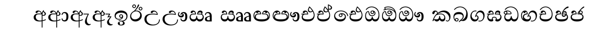
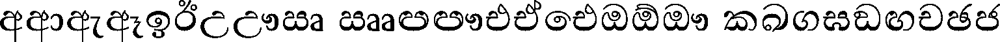

# Лабораторная работа №7. Классификация на основе признаков, анализ профилей

## Вариант 9: сингальский алфавит

Распознаваемая строка:
`අආඇඈඉඊඋඌඍ ඎඏඐඑඒඓඔඕඖ කඛගඝඞඟචඡජ`

Эталон для сравнения (без пробелов):
`අආඇඈඉඊඋඌඍඎඏඐඑඒඓඔඕඖකඛගඝඞඟචඡජ`

---

## 1. Мера близости по признакам (евклидово расстояние)

- Для каждого символа рассчитываются нормированные признаки:
  - веса четвертей (`relative_weight_I..IV`);
  - относительные координаты центра тяжести (`relative_center_x/y`);
  - относительные моменты инерции (`relative_inertia_x/y`).
- Мера близости по признакам: `1 - d / d_max`, где `d` — евклидово расстояние в пространстве признаков.
- Дополнительно (магистерский пункт): близость профилей по расстоянию Левенштейна.

## 2. Расчёт N гипотез для каждого символа

- Для каждого сегмента строки считаются оценки близости со всеми символами алфавита.
- Гипотезы сортируются по итоговой оценке `final_score`.

## 3. Вывод гипотез в файл

- Базовая строка: `results/result.csv`, `results/result.txt`
- Большой кегль: `results/result_for_bigger.csv`, `results/result_for_bigger.txt`

## 4. Лучшие гипотезы и восстановление строки

### Исходная строка (базовый кегль)

### Исходное изображение

Полученное предложение:
`අආඇඈඉඊඋඌඍඎඏඐඑඒඓඔඕඖකඛගඝඞඟචඡජ`

### Исходная строка (увеличенный кегль)

Полученное предложение:
`අආඇඈඉඊඋඌඍඎඏඐඑඒඓඔඕඖකඛගඝඞඟචඡජ`

---

## 5. Количество ошибок и доля верных распознаваний

- Для базового кегля:
  - Ошибки: **0**
  - Точность: **100.00%**
- Для увеличенного кегля:
  - Ошибки: **0**
  - Точность: **100.00%**

### Остальные наборы(попытки)
### Набор 2: `profile_len=24`, `feature_weight=0.85`, `profile_weight=0.15`

#### Исходная строка (базовый кегль)

#### Исходное изображение

Полученное предложение:
`අආඇඈඉඊඋඌඍඎඏඐඑඒඓඔඕඖකඛගඝඞඟචඡජ`

#### Исходная строка (увеличенный кегль)

Полученное предложение:
`අආඈඈඉඊඋඌඍඎඏඐඑඒඓඔඕඖකඛගඝඞඟචඡජ`

- Ошибки (базовый): **0**, точность: **100.00%**
- Ошибки (увеличенный): **1**, точность: **96.30%**
- Файлы: `res_temp/pl24_fw085/result.csv`, `res_temp/pl24_fw085/result_for_bigger.csv`, `res_temp/pl24_fw085/summary.json`, `res_temp/pl24_fw085/summary_for_bigger.json`

### Набор 3: `profile_len=8`, `feature_weight=0.00`, `profile_weight=1.00`

#### Исходная строка (базовый кегль)

#### Исходное изображение

Полученное предложение:
`අආඇඈඉඊඋඌඍඎඏඐඑඒඓමඕඖකඛගඝඪඟචඡජ`

#### Исходная строка (увеличенный кегль)

Полученное предложение:
`අආඇඇඉඊඋඌඍඎඏඐඪඒඓඔඕඖකඛඊඝඩඟඩඡජ`

- Ошибки (базовый): **2**, точность: **92.59%**
- Ошибки (увеличенный): **5**, точность: **81.48%**
- Файлы: `res_temp/pl8_fw000/result.csv`, `res_temp/pl8_fw000/result_for_bigger.csv`, `res_temp/pl8_fw000/summary.json`, `res_temp/pl8_fw000/summary_for_bigger.json`
## 6. Эксперимент с другим размером шрифта и сравнение

- После подбора параметров качество распознавания совпадает для базового и увеличенного кегля.
- Оптимальные параметры:
  - `profile_len`: **32**
  - `feature_weight`: **0.45**
  - `profile_weight`: **0.55**
  - `base_acc`: **100.00%**
  - `big_acc`: **100.00%**

---

### Заключение

1. **Реализована мера близости символов по признакам**  
   - Использовано евклидово расстояние в пространстве нормализованных признаков (веса, центр тяжести, моменты инерции).  
   - Введена оценка близости, где нулевому расстоянию соответствует максимальная близость.

2. **Построен классификатор с гипотезами по каждому символу**  
   - Для каждого выделенного символа вычислены оценки близости со всеми символами алфавита.  
   - Гипотезы отсортированы по убыванию итоговой оценки.

3. **Сформированы выходные файлы с результатами распознавания**  
   - Сохранены полные таблицы гипотез для базового и увеличенного кегля.  
   - Восстановлены итоговые строки по лучшим гипотезам.

4. **Проведена оценка качества распознавания**  
   - Для оптимального набора параметров получены ошибки и точность для двух экспериментов (базовый и увеличенный кегль).  
   - Дополнительно показаны менее удачные наборы параметров в `res_temp`.

5. **Выполнен эксперимент с изменением размера шрифта**  
   - Сравнено поведение классификатора на исходном и увеличенном кегле.  
   - Подтверждена устойчивость оптимального набора параметров.

**Результаты сохранены в папках:** `results/`, `res_temp/`, `src/`, `images/`.
