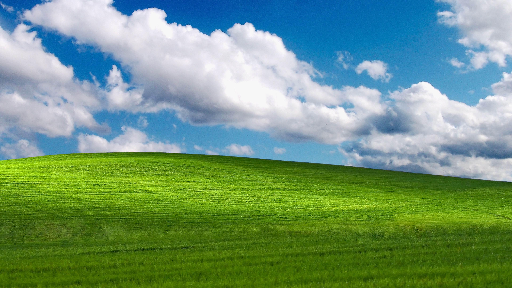
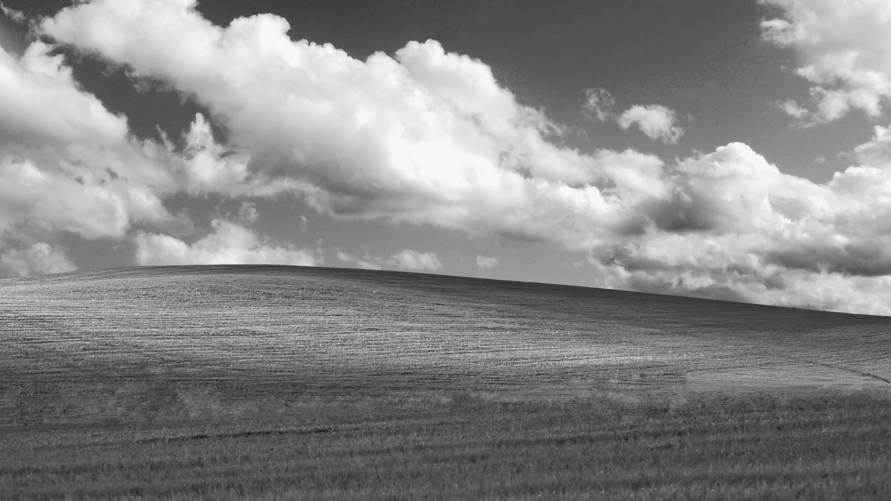
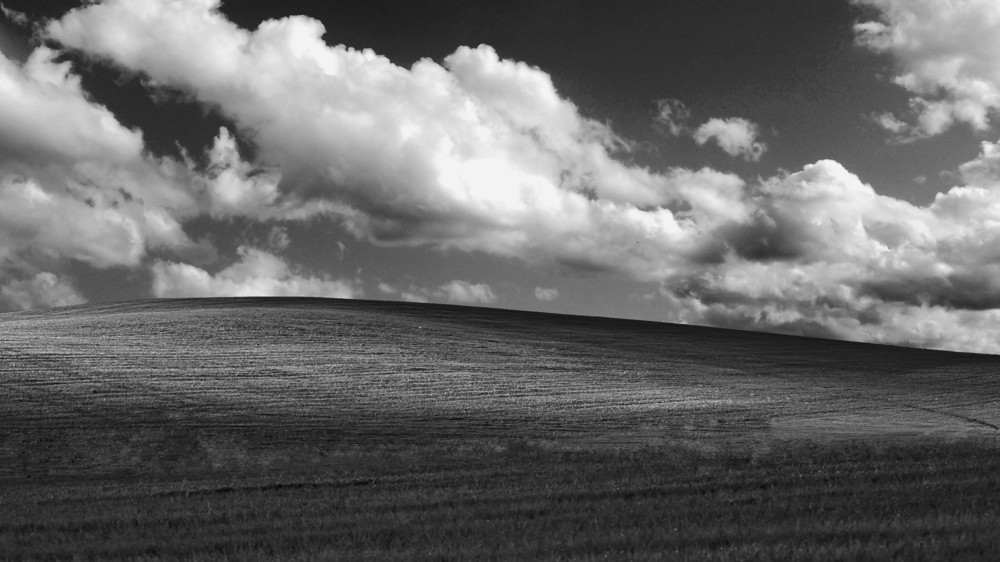
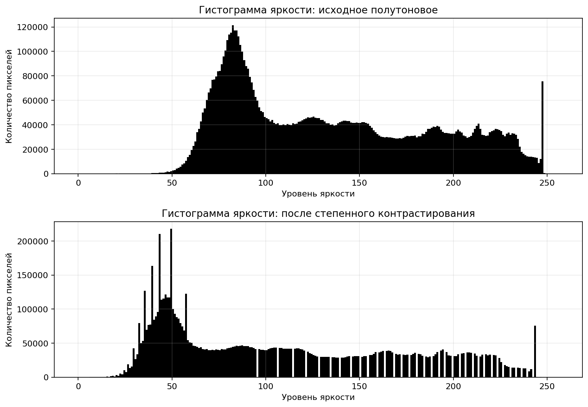
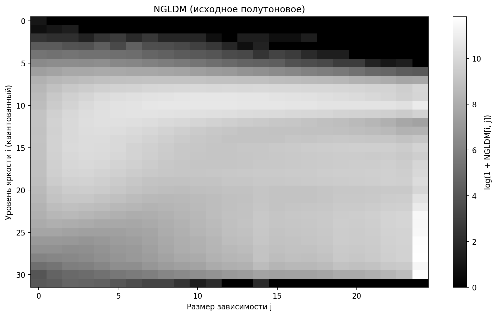
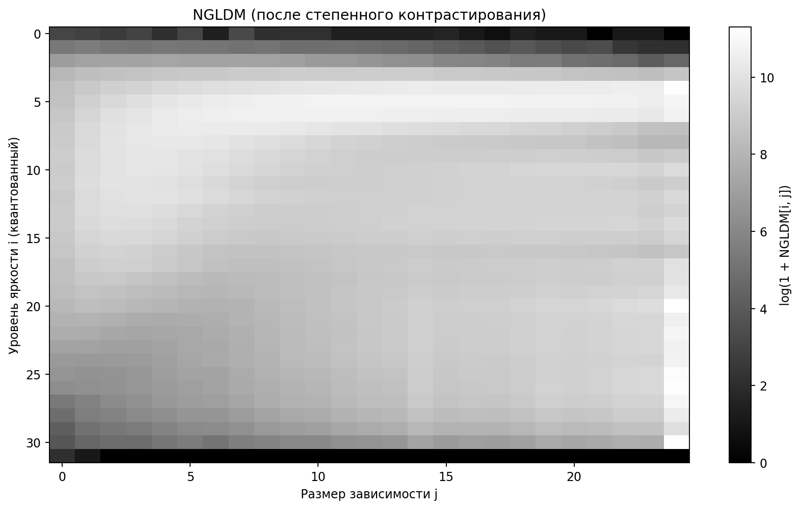

# Лабораторная работа №8. Текстурный анализ и контрастирование

## Вариант 9

- Матрица: **NGLDM**
- Параметр: **d = 2**
- Признаки: **SNE, LNE**
- Метод преобразования яркости: **степенное**
- Квантование яркости для NGLDM: **32 уровней**
- Параметр степенного преобразования: **gamma = 1.5**

## Исходные данные

### Исходное изображение

### Полутоновое изображение

### Контрастированное полутоновое изображение

## Гистограммы яркости до и после преобразования

## Матрицы NGLDM

### Для исходного полутонового изображения

### Для контрастированного изображения

## Текстурные признаки

### До контрастирования
- SNE: **0.034335**
- LNE: **273.834405**

### После контрастирования
- SNE: **0.035168**
- LNE: **268.420962**

## Сравнение

- ΔSNE = **+0.000832**
- ΔLNE = **-5.413442**

## Заключение

1. **Построена матрица NGLDM**  
   - Для исходного изображения сформирована матрица `NGLDM` при `d=2`.  
   - Вычислены требуемые признаки `SNE` и `LNE`.

2. **Выполнена визуализация матриц для двух состояний изображения**  
   - Построены матрицы для исходного и контрастированного полутоновых изображений.  
   - Для наглядности применена логарифмическая нормировка и отображение в градациях серого.

3. **Применено преобразование яркости**  
   - К полутоновому изображению применено степенное контрастирование.  
   - Получено контрастированное полутоновое изображение для последующего анализа.

4. **Построены гистограммы яркости до и после преобразования**  
   - Сформированы и сохранены гистограммы исходного и контрастированного изображений.  
   - По гистограммам виден сдвиг распределения яркостей после преобразования.

5. **Проведено сравнение текстурных признаков**  
   - Сопоставлены значения `SNE` и `LNE` для двух изображений.  
   - Зафиксированы приращения `ΔSNE` и `ΔLNE`, отражающие изменение текстурной структуры.

**Результаты сохранены в папках:** `results/`.
