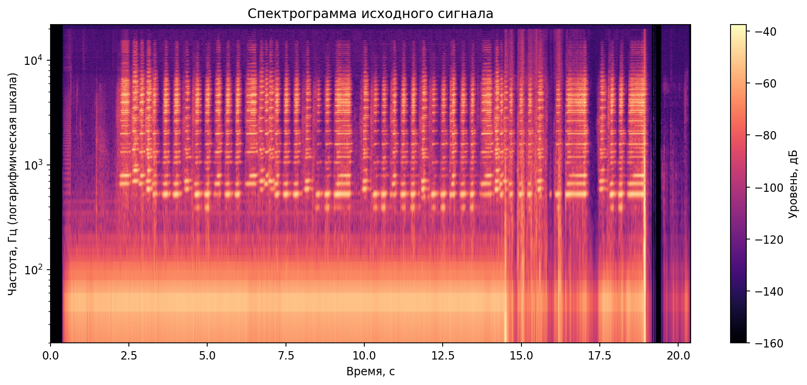
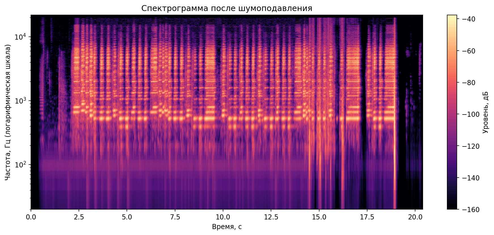
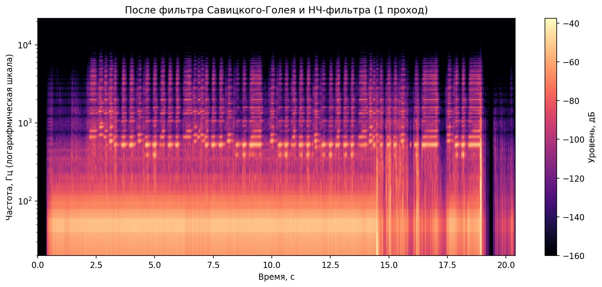

# Лабораторная работа №9. Анализ шума

## 1. Подготовка звуковой дорожки

- Исходный файл: **pattern_mono.wav**
- Частота дискретизации: **44100 Гц**
- Длительность: **20.380 с**
- Количество каналов: **1**

## 2. Построение спектрограммы (STFT, окно Ханна)

Построена спектрограмма исходного сигнала с использованием STFT и окна Ханна.
Частота отображается в логарифмической шкале.

## 3. Оценка шума, шумопонижение и восстановление звука

### 3.1. Метод спектрального вычитания

- Коэффициент подавления `k`: **3.2**
- Нижний порог подавления: **0.01**
- Средняя оценка SNR до обработки: **32.905 дБ**
- Средняя оценка SNR после обработки: **48.350 дБ**
- Прирост SNR: **+15.445 дБ**
- Восстановленный файл: `results/pattern_denoised.wav`

### 3.2. Фильтр Савицкого-Голея + НЧ-фильтр

- SNR-прокси после фильтра Савицкого-Голея: **0.801 дБ**
- SNR-прокси после НЧ-фильтра (1 проход): **0.755 дБ**
- SNR-прокси после НЧ-фильтра (2 прохода): **0.702 дБ**
- Файлы: `results/denoised_savgol.wav`, `results/denoised_lowpass_once.wav`, `results/denoised_lowpass_twice.wav`

## 4. Поиск моментов с наибольшей энергией (Δt = 0.1 c, Δf = 45 Гц)

Результаты сохранены в файлах:
- `results/energy_peaks.json`
- `results/energy_peaks.csv`
- `results/energy_peaks.txt`

5 временно-частотных интервалов по энергии:
- 1. `t=[18.80; 18.90] c`, `f=[4005.0; 4050.0] Гц`, `E=0.001000`
- 2. `t=[2.30; 2.40] c`, `f=[4005.0; 4050.0] Гц`, `E=0.000918`
- 3. `t=[18.80; 18.90] c`, `f=[4770.0; 4815.0] Гц`, `E=0.000863`
- 4. `t=[18.80; 18.90] c`, `f=[3960.0; 4005.0] Гц`, `E=0.000808`
- 5. `t=[13.80; 13.90] c`, `f=[4680.0; 4725.0] Гц`, `E=0.000734`

## Заключение

Подготовлен одноканальный WAV, построена спектрограмма с окном Ханна,
выполнено шумопонижение с восстановлением звуковой дорожки и найдено
положение максимумов энергии при `Δt=0.1 c` и `Δf=45 Гц`.
